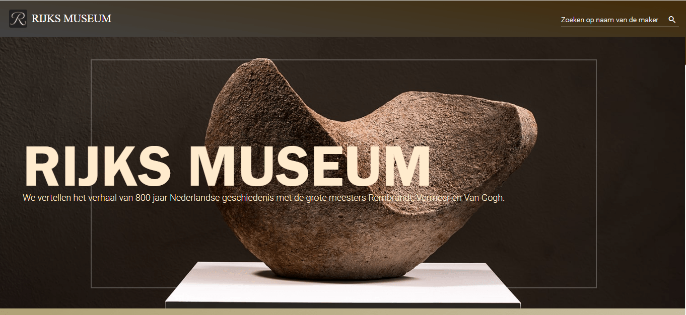
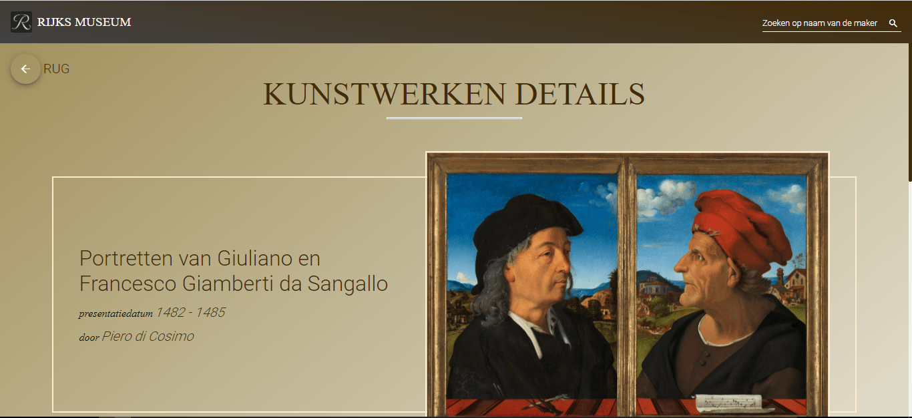

# RijksMuseum <a style="font-size:20px" href="https://rijks-museum-nl.web.app/">(live demo)</a>

    
    

Rijks museum application is exibition website to showcases the arts and crafts from some of featured master. 
Homepage contains the the featured collection. You can search the collection by maker name. Also see the details by clicking on the collection. Details can be year of artswork, maker name, description of arts, material used, location of the collection created, techniques used etc.

## View live demo at :
https://rijks-museum-nl.web.app/

## Development

This project was generated with [Angular CLI](https://github.com/angular/angular-cli) version 12.2.11.

## Development server

Run `ng serve` for a dev server. Navigate to `http://localhost:4200/`. The app will automatically reload if you change any of the source files.

## Code scaffolding

Run `ng generate component component-name` to generate a new component. You can also use `ng generate directive|pipe|service|class|guard|interface|enum|module`.

## Build

Run `ng build` to build the project. The build artifacts will be stored in the `dist/` directory.

## Running unit tests

Run `ng test` to execute the unit tests via [Karma](https://karma-runner.github.io).

## Running end-to-end tests

Run `ng e2e` to execute the end-to-end tests via a platform of your choice. To use this command, you need to first add a package that implements end-to-end testing capabilities.

## Further help

To get more help on the Angular CLI use `ng help` or go check out the [Angular CLI Overview and Command Reference](https://angular.io/cli) page.
